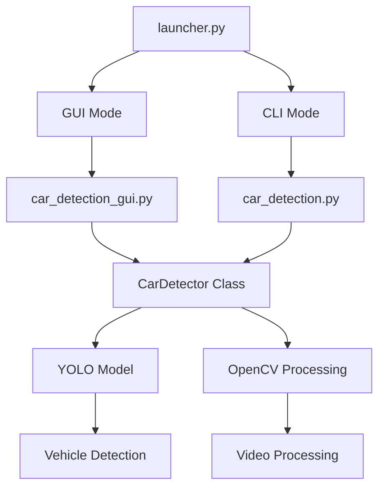

# 🚗 โปรแกรมตรวจจับรถยนต์จากวิดีโอ

<div align="center">
  
[](https://python.org)
[](LICENSE)
[](https://github.com/ultralytics/ultralytics)

*โปรแกรมตรวจจับรถยนต์และยานพาหนะอัจฉริยะ พร้อม GUI ที่ใช้งานง่าย*

</div>

---

## 📋 คำอธิบาย

โปรแกรมนี้ใช้ **YOLO v8 (You Only Look Once)** ซึ่งเป็น Deep Learning model ที่ทันสมัยสำหรับการตรวจจับวัตถุ เพื่อระบุและนับจำนวนรถยนต์และยานพาหนะประเภทต่างๆ จากวิดีโอหรือกล้อง webcam แบบ real-time

## ✨ คุณสมบัติหลัก

### 🎯 การตรวจจับที่แม่นยำ
- 🚗 **รถยนต์** - ตรวจจับรถยนต์ทุกประเภท
- 🏍️ **จักรยานยนต์** - รถมอเตอร์ไซค์และสกู๊ตเตอร์
- 🚌 **รถบัส** - รถโดยสารและรถทัวร์
- 🚛 **รถบรรทุก** - รถบรรทุกทุกขนาด

### 📱 สองรูปแบบการใช้งาน
- **🖥️ GUI (Graphical User Interface)** - เหมาะสำหรับผู้ใช้ทั่วไป
- **💻 Command Line Interface** - เหมาะสำหรับผู้ใช้ขั้นสูง

### 🎥 รองรับหลายแหล่งข้อมูล
- 📁 ไฟล์วิดีโอ (MP4, AVI, MOV, MKV, WMV, FLV)
- 🎥 กล้อง Webcam แบบ real-time
- 🎬 การบันทึกผลลัพธ์เป็นวิดีโอ

### 📊 คุณสมบัติขั้นสูง
- ⚙️ ปรับระดับความเชื่อมั่นได้
- 📈 แสดงสถิติการทำงานแบบ real-time
- 🎨 Bounding box สีสันตามประเภทรถ
- ⚡ Multi-threading สำหรับประสิทธิภาพสูง
- 📊 Progress bar แสดงความคืบหน้า

## 🚀 การติดตั้ง

### ข้อกำหนดระบบ
- **Python 3.7+** 
- **4GB RAM** (แนะนำ 8GB+)
- **กล้อง Webcam** (สำหรับการตรวจจับแบบ real-time)
- **GPU ที่รองรับ CUDA** (ไม่บังคับ แต่จะเร็วกว่า)

### ขั้นตอนการติดตั้ง

1. **Clone repository นี้**
   ```bash
   git clone https://github.com/P33els/car_tracker_video.git
   cd car_tracker_video
   ```

2. **ติดตั้ง Python packages ที่จำเป็น**
   ```bash
   pip install opencv-python ultralytics numpy matplotlib Pillow
   ```

3. **ดาวน์โหลด YOLO model** (จะดาวน์โหลดอัตโนมัติเมื่อใช้งานครั้งแรก)
   ```bash
   # ไฟล์ yolov8n.pt จะถูกดาวน์โหลดอัตโนมัติ
   ```

### 📦 Package ที่ต้องใช้
| Package | เวอร์ชัน | วัตถุประสงค์ |
|---------|---------|------------|
| `opencv-python` | ≥4.5.0 | ประมวลผลภาพและวิดีโอ |
| `ultralytics` | ≥8.0.0 | YOLO model และการตรวจจับ |
| `numpy` | ≥1.20.0 | การคำนวณและจัดการ array |
| `Pillow` | ≥8.0.0 | จัดการภาพสำหรับ GUI |
| `matplotlib` | ≥3.3.0 | การสร้างกราฟ (ไม่บังคับ) |

## 🎮 การใช้งาน

### 🚀 วิธีเริ่มต้น (แนะนำ)

**เรียกใช้ Launcher เพื่อเลือกโปรแกรม:**
```bash
python launcher.py
```

<div align="center">


</div>

---

### 🖥️ โหมด GUI (แนะนำสำหรับผู้ใช้ทั่วไป)

```bash
python car_detection_gui.py
```

**คุณสมบัติ GUI:**
- 🎨 ส่วนต่อประสานที่ใช้งานง่าย
- 📁 เลือกไฟล์วิดีโอผ่าน File Dialog
- ⚙️ ปรับตั้งค่าต่างๆ แบบ Real-time
- 📊 แสดงสถิติการทำงานสด
- 🎥 ดูตัวอย่างการประมวลผลได้ทันที
- 📈 Progress Bar แสดงความคืบหน้า

### 💻 โหมด Command Line

```bash
python car_detection.py
```

**ขั้นตอน:**
1. เลือกโหมดการทำงาน (วิดีโอหรือ webcam)
2. ใส่เส้นทางไฟล์วิดีโอ
3. เลือกว่าจะบันทึกผลลัพธ์หรือไม่

### 🧑‍💻 การเขียนโค้ดเอง

```python
from car_detection import CarDetector

# สร้าง detector
detector = CarDetector()

# วิธีที่ 1: ประมวลผลวิดีโอ
detector.process_video(
    video_path="input_video.mp4",
    output_path="output_video.mp4",  # ไม่บังคับ
    show_preview=True
)

# วิธีที่ 2: ใช้กับ webcam
detector.process_webcam(camera_index=0)

# วิธีที่ 3: ประมวลผลเฟรมเดียว
frame = cv2.imread("test_image.jpg")
processed_frame, count, details = detector.detect_vehicles_in_frame(
    frame, confidence_threshold=0.5
)
```

### 📱 ตัวอย่างการใช้งานเบื้องต้น

```bash
python example_usage.py
```

## 🎯 รายละเอียดการทำงาน

### 🚦 ประเภทยานพาหนะที่ตรวจจับได้

| ประเภท | สี Bounding Box | คำอธิบาย |
|--------|----------------|----------|
| 🚗 **รถยนต์** |  | รถยนต์นั่งส่วนบุคคล, รถเก๋ง |
| 🏍️ **จักรยานยนต์** |  | รถมอเตอร์ไซค์, สกู๊ตเตอร์ |
| 🚌 **รถบัส** |  | รถโดยสาร, รถทัวร์ |
| 🚛 **รถบรรทุก** |  | รถบรรทุก, รถหกล้อสิบล้อ |

### 📊 ผลลัพธ์ที่ได้รับ

#### 🎨 การแสดงผลภาพ
- **Bounding Box** รอบยานพาหนะที่ตรวจพบ
- **ป้ายกำกับ** แสดงชื่อประเภทและค่าความเชื่อมั่น
- **สีที่แตกต่าง** สำหรับแต่ละประเภทรถ

#### 📈 ข้อมูลสถิติ
- จำนวนยานพาหนะในแต่ละเฟรม
- จำนวนยานพาหนะสะสมทั้งหมด
- ความเร็วการประมวลผล (FPS)
- ค่าความเชื่อมั่น (Confidence Score) 0.0-1.0
- เวลาที่ใช้ในการประมวลผล

#### 🔢 รูปแบบข้อมูลส่งออก
```python
# ตัวอย่างข้อมูลที่ได้รับ
detection_details = [
    {
        'class_name': 'รถยนต์',
        'confidence': 0.85,
        'bbox': (100, 150, 300, 250)  # (x1, y1, x2, y2)
    },
    {
        'class_name': 'จักรยานยนต์',
        'confidence': 0.72,
        'bbox': (400, 180, 480, 280)
    }
]
```

## ⚙️ การปรับแต่งและกำหนดค่า

### 🎚️ ปรับระดับความเชื่อมั่น (Confidence Threshold)

```python
detector = CarDetector()

# การตั้งค่าระดับความเชื่อมั่น
confidence_levels = {
    0.3: "ตรวจจับได้มาก (อาจมีผลลัพธ์ผิด)",
    0.5: "สมดุล (แนะนำสำหรับการใช้งานทั่วไป)",
    0.7: "แม่นยำสูง (อาจพลาดบางกรณี)",
    0.9: "แม่นยำมาก (ตรวจจับเฉพาะกรณีที่แน่ชัด)"
}

# ใช้งาน
processed_frame, count, details = detector.detect_vehicles_in_frame(
    frame, confidence_threshold=0.5  # เปลี่ยนค่าตามต้องการ
)
```

### 🤖 เลือกโมเดล YOLO ตามประสิทธิภาพ

| Model | ขนาดไฟล์ | ความเร็ว | ความแม่นยำ | การใช้งานแนะนำ |
|-------|----------|----------|------------|----------------|
| `yolov8n.pt` | ~6MB | ⚡⚡⚡⚡⚡ | ⭐⭐⭐ | Real-time, อุปกรณ์ช้า |
| `yolov8s.pt` | ~22MB | ⚡⚡⚡⚡ | ⭐⭐⭐⭐ | สมดุลทั่วไป |
| `yolov8m.pt` | ~52MB | ⚡⚡⚡ | ⭐⭐⭐⭐⭐ | ความแม่นยำสูง |
| `yolov8l.pt` | ~87MB | ⚡⚡ | ⭐⭐⭐⭐⭐ | การวิเคราะห์ละเอียด |
| `yolov8x.pt` | ~136MB | ⚡ | ⭐⭐⭐⭐⭐⭐ | ความแม่นยำสูงสุด |

```python
# ตัวอย่างการเลือก model
detector_fast = CarDetector('yolov8n.pt')      # เร็ว แต่แม่นยำปานกลาง
detector_balanced = CarDetector('yolov8s.pt')  # สมดุล (แนะนำ)
detector_accurate = CarDetector('yolov8x.pt')  # แม่นยำสูง แต่ช้า
```

### 🎛️ การตั้งค่าขั้นสูง

```python
# กำหนดค่าสำหรับการประมวลผล
detector = CarDetector()

# ปรับการแสดงผล
detector.process_video(
    video_path="input.mp4",
    output_path="output.mp4",
    show_preview=True,          # แสดงตัวอย่างหรือไม่
)

# การปรับแต่งสี bounding box
detector.colors = {
    2: (0, 255, 0),    # รถยนต์ - เขียว
    3: (255, 0, 0),    # จักรยานยนต์ - น้ำเงิน  
    5: (0, 0, 255),    # รถบัส - แดง
    7: (255, 255, 0)   # รถบรรทุก - ฟ้า
}
```

## 📁 โครงสร้างไฟล์

```
📦 car_tracker_video/
├── 📜 launcher.py              # 🚀 หน้าเลือกโปรแกรม (เริ่มต้นที่นี่)
├── 🖥️ car_detection_gui.py     # GUI สำหรับผู้ใช้ทั่วไป
├── 💻 car_detection.py         # Command Line Interface
├── 📘 example_usage.py         # ตัวอย่างการใช้งาน
├── 🤖 yolov8n.pt              # YOLO Model (ดาวน์โหลดอัตโนมัติ)
├── 📚 README.md               # คู่มือนี้
├── 📖 GUI_README.md           # คู่มือการใช้งาน GUI
├── 📁 test_traffic/           # วิดีโอตัวอย่าง (ถ้ามี)
└── 📁 __pycache__/            # Cache files
```

### 📋 รายละเอียดไฟล์หลัก

| ไฟล์ | วัตถุประสงค์ | ผู้ใช้เป้าหมาย |
|------|-------------|----------------|
| `launcher.py` | หน้าเลือกโปรแกรม | ผู้ใช้ทุกคน |
| `car_detection_gui.py` | GUI แบบครบครัน | ผู้ใช้ทั่วไป |
| `car_detection.py` | Command Line | ผู้ใช้ขั้นสูง |
| `example_usage.py` | ตัวอย่างและการทดสอบ | นักพัฒนา |

## 🏗️ สถาปัตยกรรมของระบบ



## 🚨 การแก้ปัญหา

### 📹 ปัญหาเกี่ยวกับกล้อง Webcam

| ปัญหา | สาเหตุ | วิธีแก้ไข |
|-------|--------|----------|
| ไม่พบกล้อง | กล้องถูกใช้งานอยู่ | ปิดโปรแกรมอื่นที่ใช้กล้อง |
| ภาพไม่ขึ้น | Camera index ผิด | ลองเปลี่ยน `camera_index=1,2,3...` |
| คุณภาพภาพแย่ | ความละเอียดต่ำ | ตรวจสอบการตั้งค่ากล้อง |

```python
# วิธีแก้ปัญหากล้อง
detector.process_webcam(camera_index=0)  # ลองเปลี่ยนเป็น 1, 2, 3
```

### ⚡ ปัญหาประสิทธิภาพ

| อาการ | สาเหตุ | วิธีแก้ไข |
|-------|--------|----------|
| ประมวลผลช้า | Model ใหญ่เกินไป | ใช้ `yolov8n.pt` |
| RAM หมด | วิดีโอความละเอียดสูง | ลดขนาดวิดีโอก่อน |
| CPU ใช้งานสูง | แสดงตัวอย่างเปิดอยู่ | `show_preview=False` |

```python
# การปรับแต่งประสิทธิภาพ
detector = CarDetector('yolov8n.pt')  # Model เล็กสุด
detector.process_video(
    video_path="input.mp4",
    show_preview=False,  # ปิดการแสดงตัวอย่าง
)
```

### 🎯 ปัญหาความแม่นยำ

| อาการ | สาเหตุ | วิธีแก้ไข |
|-------|--------|----------|
| ตรวจจับไม่ครบ | Confidence สูงเกินไป | ลดค่า `confidence_threshold` |
| ตรวจจับผิด | Confidence ต่ำเกินไป | เพิ่มค่า `confidence_threshold` |
| ภาพมืด/เบลอ | คุณภาพวิดีโอแย่ | ใช้วิดีโอคุณภาพดีกว่า |

### 🔧 ปัญหาการติดตั้ง

```bash
# ถ้า import ไม่ได้
pip install --upgrade opencv-python ultralytics

# ถ้า GUI ไม่ทำงาน  
pip install --upgrade Pillow tkinter

# ถ้า CUDA ไม่ทำงาน
pip install torch torchvision --index-url https://download.pytorch.org/whl/cu118
```

### 💡 เคล็ดลับเพิ่มประสิทธิภาพ

1. **ใช้ GPU**: ติดตั้ง CUDA และ PyTorch รุ่นที่รองรับ
2. **ลดขนาดวิดีโอ**: ประมวลผลที่ 720p แทน 1080p หรือ 4K
3. **ปิดโปรแกรมอื่น**: เพื่อให้ RAM และ CPU เหลือเฟือ
4. **ใช้ SSD**: เร็วกว่า HDD ในการอ่าน/เขียนไฟล์

## 📊 ตัวอย่างผลลัพธ์

### 💻 Output Command Line
```bash
=== โปรแกรมตรวจจับรถยนต์ ===
กำลังโหลด YOLO model...
โหลด model สำเร็จ!

ข้อมูลวิดีโอ:
  - ความละเอียด: 1920x1080  
  - FPS: 30
  - จำนวนเฟรม: 1500

เริ่มประมวลผลวิดีโอ...
ความคืบหน้า: 50.0% (750/1500 เฟรม) - เวลาคงเหลือประมาณ: 23 วินาที
ความคืบหน้า: 100.0% (1500/1500 เฟรม) - เวลาคงเหลือประมาณ: 0 วินาที

=== สรุปผลลัพธ์ ===
ประมวลผลเสร็จสิ้น!
เวลาที่ใช้: 45.23 วินาที
ประมวลผล 1500 เฟรม  
ความเร็วเฉลี่ย: 33.17 FPS
พบรถทั้งหมด: 4,267 คัน
  - รถยนต์: 3,105 คัน
  - จักรยานยนต์: 892 คัน  
  - รถบัส: 78 คัน
  - รถบรรทุก: 192 คัน
บันทึกวิดีโอที่: output_detected_cars.mp4
```

### 📱 GUI Statistics Display
```
┌─────────────── สถิติการตรวจจับ ───────────────┐
│ เฟรม: 750/1500                              │
│ รถในเฟรม: 12                                │  
│ รถทั้งหมด: 2,145                            │
│ FPS: 28.3                                   │
└──────────────────────────────────────────────┘
```

### 🎯 Benchmark ประสิทธิภาพ

| Hardware | Model | Resolution | FPS | Accuracy |
|----------|-------|------------|-----|----------|
| CPU i5-8400 | yolov8n | 720p | ~15 FPS | 85% |
| CPU i7-10700 | yolov8s | 1080p | ~12 FPS | 90% |
| RTX 3060 | yolov8n | 1080p | ~45 FPS | 85% |
| RTX 3080 | yolov8m | 4K | ~25 FPS | 93% |

---

## 🤝 การมีส่วนร่วม

เรายินดีรับการมีส่วนร่วมจากชุมชน! 

### 📝 การรายงานปัญหา
1. เปิด [Issue](https://github.com/P33els/car_tracker_video/issues) ใหม่
2. อธิบายปัญหาและขั้นตอนการทำซ้ำ
3. แนบ screenshot หรือวิดีโอ (ถ้ามี)

### 🔧 การส่ง Pull Request
1. Fork repository นี้
2. สร้าง branch ใหม่สำหรับ feature
3. Test ให้แน่ใจว่าทำงานได้
4. ส่ง Pull Request พร้อมอธิบายการเปลี่ยนแปลง

---

## 📄 License

Project นี้อยู่ภายใต้ [MIT License](LICENSE) - ดูรายละเอียดในไฟล์ LICENSE

---

## 🙏 กิตติกรรมประกาศ

- **YOLOv8** by [Ultralytics](https://github.com/ultralytics/ultralytics)
- **OpenCV** Community
- **COCO Dataset** for pre-trained models
- **Python** Community และ Contributors ทั้งหมด

---

## 📞 ติดต่อ

- **GitHub**: [P33els](https://github.com/P33els)
- **Repository**: [car_tracker_video](https://github.com/P33els/car_tracker_video)

---

<div align="center">

### ⭐ ถ้าชอบโปรเจคนี้ กรุณากด Star ให้กำลังใจด้วยนะครับ! ⭐

[](https://github.com/P33els/car_tracker_video/stargazers)
[](https://github.com/P33els/car_tracker_video/network)

</div>